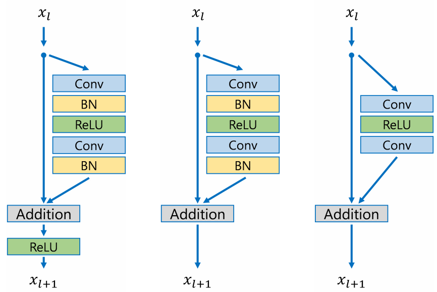
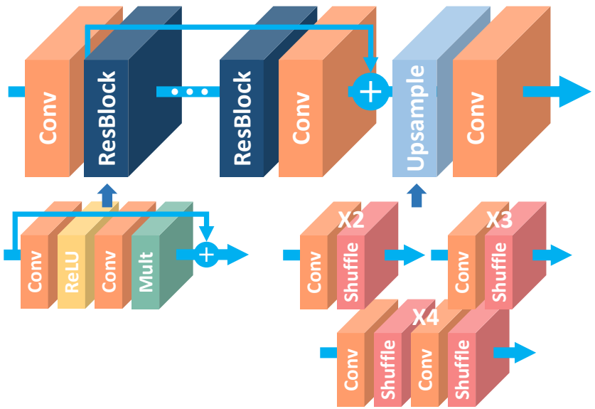
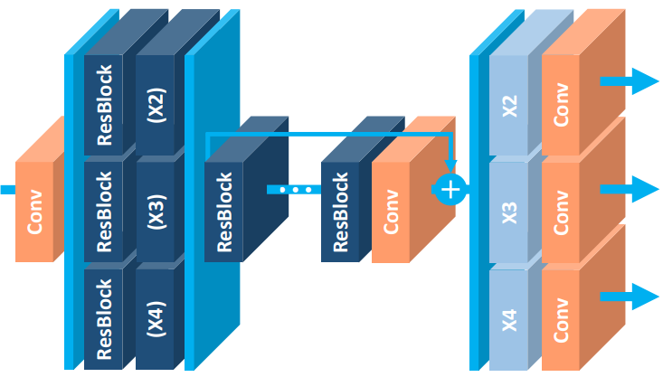
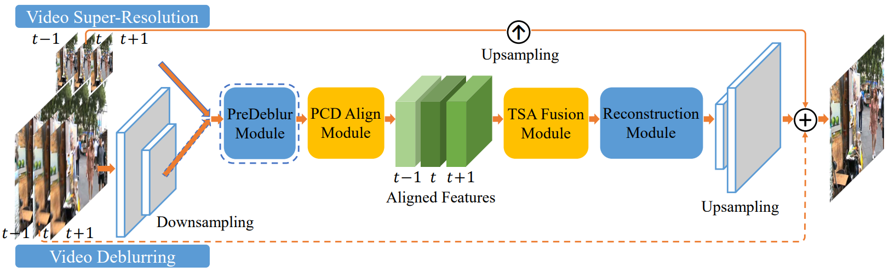

# Super-Resolution
## 1. SRGAN
Ledig, C., Theis, L., Huszár, F., Caballero, J., Cunningham, A., Acosta, A., ... & Wang, Z. (2016). Photo-realistic single image super-resolution using a generative adversarial network. arXiv preprint 2016.

### 요약
- Super Resolution(SR, 화질 개선 및 이미지 사이즈 증가) 알고리즘
- 기존 SR 알고리즘은 loss를 (pixel-wise)MSE과 PSNR로 구성 &#8594; 생성된 이미지의 질감(texture) 표현에 한계(smooth하게만 표현)
- loss를 개선하여 기존 알고리즘의 한계 극복 &#8594; Perceptual loss function(Content loss + Adversarial loss)

### Method
#### (1) Architecture
- GAN  

#### (2) Loss function
- Perceptual loss function  

- Content loss  

  이미지 자체(pixel)를 비교하던 기존 loss를 feature map을 비교하는 loss로 변경  
  
  __기존의 pixel-wise MSE loss__  
  

  __수정된 loss(Content loss)__  
  

- Advrsarial loss  

  

## 2. EDSR
Lim, B., Son, S., Kim, H., Nah, S., & Mu Lee, K. (2017). Enhanced deep residual networks for single image super-resolution. In Proceedings of the IEEE conference on computer vision and pattern recognition workshops (pp. 136-144).

### 요약
- ResNet 구조에서 필요하지 않은 모듈을 제거하여 성능을 높임(EDSR)
- 여러 scale에 공통으로 포함되는 정보를 공유하는 새로운 multi-scale 구조를 제안(MDSR)
- MDSR은 여러 개의 Scale 모델에 비해 적은 수의 매개 변수를 사용하며, 비슷한 성능을 보임

### Method
#### (1) EDSR Architecture
- Batch Normalization(BN) 제거

  BNormalization은 특정 범위로 정규화를 하는 역할을 하므로 기존의 Classificaton & Detection 문제와 다르게 제거하는 것이 좋음 &#8594; GPU 메모리 사용량을 줄여 결과적으로 더 큰 모델 제작이 가능
  

- 해상도 별(x2, x3, x4) 네트워크 개별 학습: 해상도 별 네트워크 구조는 Upsampling을 제외하고 모두 같음 & Upsampling의 경우 SRGAN과 동일하게 Shuffle을 사용하며 학습 가능

- Residual scaling을 적용하여 Feature map의 개수를 늘려 더 많은 정보를 학습
- x2 scale에 대한 사전 학습된 정보를 이용하여 x3, x4 scale을 학습 &#8594; 더 빠른 수렴 가능
  
#### (2) MDSR Architecture
- Scale-specific processing module : 네트워크 앞에 위치. 다양한 scale의 입력 이미지에 대해 분산을 줄이는 역할
- Scale-specific upsampling module : 네트워크 뒤에 위치. 다양한 scale에 대해 upsampling해주는 역할로 EDSR의 구조와 유사
- 중앙의 ResBlocks를 공유 &#8594; EDSR 3개의 파라미터보다 더 적은 파라미터를 사용

## 3. ESRGAN
Wang, X., Yu, K., Wu, S., Gu, J., Liu, Y., Dong, C., ... & Change Loy, C. (2018). Esrgan: Enhanced super-resolution generative adversarial networks. In Proceedings of the European Conference on Computer Vision (ECCV) Workshops (pp. 0-0).

### 요약
- SRGAN에서 3가지 부분(Architecture, Discriminator, Perceptual loss) 개선  

### Method  
#### (1) Architecture(Generator)  
- Batch Normalization(BN) 제거 & Residual scaling 도입 
 
  BN은 훈련 중에 batch의 평균과 분산을 사용하여 feature를 normalize하고 테스트 중에 전체 학습 데이터의 추정된 평균과 분산을 사용. 훈련 및 테스트 데이터의 통계값이 많이 다를 때 BN 계층은 unpleasant artifact를 도입하고 일반화 능력 제한 &#8594; BN 레이어를 제거하여 일반화 능력을 향상시키고 계산 복잡성과 메모리 사용량을 줄임   
  residual을 0과 1사이의 상수를 곱하여 scaling down하는 Residual scaling를 도입하여 안정적으로 만듦
- Residual-in-Residual Dense Block(RDDB) 도입 &#8594; higher capacity & easier to train  

  

  

#### (2) Discriminator  
- Relativistic GAN(RaGAN) 사용: 기존 GAN의 Discriminator는 real인지 fake인지 판단하는 이진 분류였다면 RaGAN의 Discriminator는 한 이미지가 다른 이미지보다 더 실제 같은지를 판단 &#8594; more realistic texture details  
  __Standard Discriminator & Relativistic Discriminator__  

  
  __Discriminator loss__  

  
  __Generator loss__  

  

는 실제 데이터(Xr) 한 개에 대해 생성된 이미지(Xf)는 여러 개이므로, 모든 mini-batch의 fake data에 대해 average 취함  
  SRGAN에서는 Generator loss가 생성된 이미지에 대해서만 영향을 받지만 ESRGAN에서는 실제 데이터와 생성된 데이터 모두로부터 영향 받음  
#### (3) Perceptual loss 개선  
- activation 이전의 VGG feature 사용(SRGAN에서는 activation 이후의 feature 사용) &#8594; sharper edges & more visually pleasing results  
- activation을 취한 feature는 Sparse해진다는 문제 존재(특히 Very deep network일 경우 더욱 심함) &#8594; weak supervision & inferior performance(아래 그림에서 after activation을 보면 feature가 많이 사라짐을 알 수 있음)    

  
  __Total loss for the Generator__  

  
  __L1 loss(Content loss)__  

  
  LG는 Total Generator loss이며 Lpercep와 LGRa(Relativistic Discriminator에서의 Generator loss), L1로 이루어짐  
  L1은 content loss로 G(xi)와 ground-truth y와의 1-norm distance에 해당함  
#### (4) Network Interpolation  
- GPSNR(PSNR-oriented network) 학습 &#8594; fine-tuning해서 GGAN(GAN-based network) 학습
- 두 모델(GPSNR, GGAN)을 보간하여 GINTERP 모델 도출  

  

### 적용 결과  

  

## 4. EDVR
Wang, X., Chan, K. C., Yu, K., Dong, C., & Change Loy, C. (2019). Edvr: Video restoration with enhanced deformable convolutional networks. In Proceedings of the IEEE/CVF Conference on Computer Vision and Pattern Recognition Workshops (pp. 0-0).

### 요약
- PCD(Pyramid, Cascading and Deformable) & TSA(Temporal and Spatial Attention) 모듈을 사용
- PCD는 Deformable convolution을 사용하여 feature 수준에서 coarse-to-fine 방식으로 frame이 alignment됨
- TSA는 여러 align된 feature에서 중요 정보를 시공간적으로 attention하여 fusion

### Method
#### (1) Architecture
- PCD와 TSA 모듈을 사용하여 크고 다양한 동작 및 Blur 현상이 있는 frame들을 효과적으로 처리
- Fusion된 feature를 Reconstruction 모듈에 대입하고 Upsampling한 결과와, 입력 이미지를 Upsampling한 결과를 더하여 최종 Output 출력

 
  
#### (2) PCD Module
- (빨간색 박스): L1 -> L2 -> L3

  𝑡시점과 인접한 𝑡+𝑖시점의 이미지는 여러 개의 Residual Block을 지나 Feature 추출(L1)
  추출된 Feature들에 Strided Convolution을 이용하여 x2 Downsampling 수행하며(L2), 한번 더 수행하면 L3에 대한 Feature를 얻을 수 있음

#### (3) TSA Module
